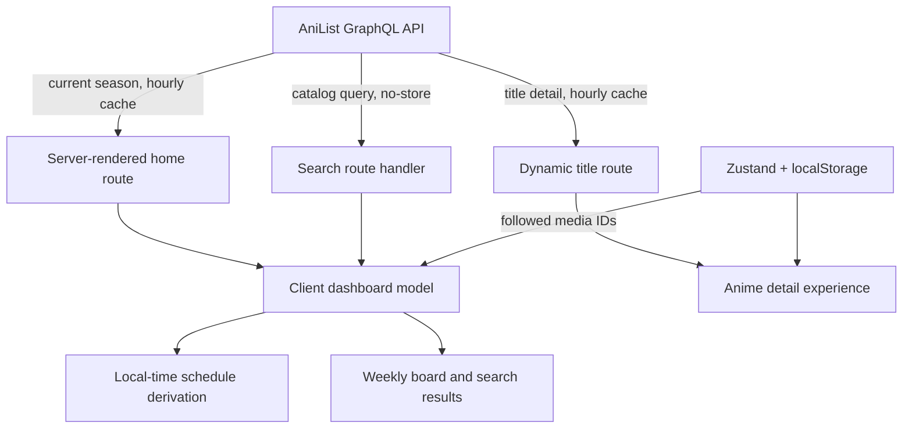

# Airing: current state and future directions

_Product and technical snapshot — July 13, 2026_

## Executive summary

Airing is a polished, read-only anime schedule and catalog companion built around
one strong question: **what is airing, and when does the next episode drop in my
timezone?** The current app already supports the complete browse loop:

1. Load the current season from AniList.
2. Organize releasing titles into a local-time weekly board.
3. Follow titles on the current device.
4. Search AniList's wider non-adult anime catalog.
5. Open a rich title page with schedule, streaming, credits, community data,
   relations, and recommendations.

The product is strongest as a fast, low-friction reference tool. Its main
limitation is that it does not yet remember a viewer's actual watching activity:
there are no accounts, episode check-ins, watch status, notifications, or sync.
That makes the clearest next direction a **personal airing companion**, not a
broader encyclopedia or social network.

## Product today

### Core promise

- Show the current anime season without requiring an account or API key.
- Translate AniList episode timestamps into the viewer's local weekday and time.
- Make the next release and current season progress scannable.
- Keep personal state deliberately small: a list of followed AniList media IDs.

### Implemented user journeys

| Journey | Current behavior | State |
| --- | --- | --- |
| Browse the season | Seven horizontally scrolling day columns, ordered from today forward | Complete |
| Understand timing | Latest episode, total episodes, progress bar, and minute-updating countdown | Complete |
| Prioritize shows | Follow/unfollow from cards or detail pages; favorites sort first | Complete, device-local |
| Filter to favorites | Desktop sidebar and compact mobile switch | Complete |
| Search the catalog | Debounced query in the URL; up to 30 AniList matches; releasing shows ranked first | Complete |
| Inspect a title | Editorial hero, synopsis, facts, next airing, episode guide, cast, staff, tags, rankings, community stats, relations, recommendations, reviews, and official links | Complete |
| Recover from failures | Dashboard load error, search error, route loading skeletons, and title 404 state | Complete |
| Resume across devices | No identity or cloud persistence | Not implemented |
| Track watched episodes | No progress or completion state owned by Airing | Not implemented |
| Receive reminders | No notifications, calendar feed, or reminder delivery | Not implemented |

On the audit date, the production build returned 70 current-season titles across
the seven-day board. That count is live data and will change with AniList and the
calendar season.

### Experience and visual language

- Dark-only Framer-inspired system with a near-black canvas, restrained
  monochrome chrome, Inter typography, compact information density, and strong
  negative tracking.
- Cover art supplies most of the board's color; blue is reserved for live and
  selected states. Title detail pages inherit the cover's AniList accent color.
- Desktop navigation uses a persistent weekday rail. Smaller layouts retain the
  schedule as a horizontal board and move the favorites control into the header.
- Loading, empty, error, focus, reduced-motion, and basic semantic states are
  present. Accessibility has not been independently audited.

### First-use caveat

`Favorites only` starts enabled. A new user therefore lands on an intentional
empty state and must choose **Clear filters** or disable the switch before seeing
the schedule. The state is understandable, but it delays the product's core
value on the first visit. Defaulting new visitors to the full schedule—or using
a first-run state that visibly previews the board—should be the first product
polish change.

## Technical shape

### Runtime and dependencies

- Next.js 16.2.10 App Router and React 19.2.4.
- TypeScript 5, Tailwind CSS 4, shadcn components on Base UI, Lucide icons.
- Zustand persistence under the `airing-follows-v1` localStorage key.
- Bun is the required package manager and script runner.
- AniList is the only application data source; read-only requests need no key.

### Route and data behavior

| Route | Rendering/data policy | Responsibility |
| --- | --- | --- |
| `/` | Static output with one-hour revalidation | Fetch up to three 50-title pages for the current season and render the dashboard |
| `/api/anime/search?q=` | Dynamic, uncached | Validate a 100-character query and proxy catalog search to AniList |
| `/anime/[id]` | Dynamic route with one-hour data revalidation | Render a rich AniList media detail page and route metadata |

Time-dependent board calculations run on the client. `deriveAiring()` selects
the most recent aired episode as the canonical weekday, falls back to the next
episode for new shows, and computes progress and countdown values. `useNow()`
provides a hydration-safe clock rounded to the minute.

### Source map

| Area | Primary files |
| --- | --- |
| AniList queries, normalization, and types | `src/lib/anilist.ts` |
| Weekday, progress, and countdown derivation | `src/lib/schedule.ts` |
| Device-local follow persistence | `src/lib/store.ts` |
| Hydration-safe minute clock | `src/lib/use-now.ts` |
| Home route and dashboard | `src/app/page.tsx`, `src/components/dashboard.tsx` |
| Schedule cards | `src/components/anime-card.tsx` |
| Search endpoint | `src/app/api/anime/search/route.ts` |
| Detail route | `src/app/anime/[id]/page.tsx` |
| Visual tokens | `src/app/globals.css`, `DESIGN.md` |

## Health, risks, and constraints

### Verified health

- `bun run lint` passes.
- `bun run build` passes, including TypeScript checking and route generation.
- The production build was exercised in-browser for the empty first-run state,
  populated weekly board, and a data-rich anime detail page.
- No automated unit, component, or end-to-end test files are present.

### Important constraints

1. **Personal state is fragile.** Follows are tied to one browser profile and
   disappear when its storage is cleared. There is no import/export path.
2. **AniList is a single dependency.** An outage or response-shape change blocks
   schedule and title data. The home route has a friendly error but no stale-data
   fallback.
3. **Search is an exposed upstream cost.** Each settled search query is proxied
   uncached to AniList. There is no explicit application rate limit or short-term
   query cache.
4. **The season fetch has a ceiling.** It reads at most three pages (150 media)
   before filtering titles without known airing timestamps. That is reasonable
   today but implicit.
5. **Quality checks stop at compile and lint.** Schedule math, persistence,
   search ranking, responsive behavior, and route error states are not protected
   by automated regression tests.
6. **The app cannot close the loop.** It knows what should air, but not what the
   viewer watched, skipped, paused, or completed.
7. **Documentation drift exists.** The README describes the original schedule
   board well but under-represents catalog search and the extensive detail route.

## Future direction options

### Direction A — Personal airing companion (recommended)

Turn the weekly board into a lightweight routine: what arrived, what is unwatched,
and what is next.

Potential capabilities:

- Mark episodes watched and surface an inbox of newly available episodes.
- Per-title watch status: planning, watching, paused, completed, dropped.
- Optional reminders and calendar subscription for followed shows.
- Local-first import/export, followed by optional account sync.
- AniList list import/sync if authentication is introduced.

Why it fits: it deepens the current promise and reuses the schedule, follow, and
detail foundations. It creates repeat value without requiring Airing to build a
new content graph.

### Direction B — Seasonal discovery guide

Help users decide what to start, not only remember what they already follow.

Potential capabilities:

- Genre, format, studio, score, language, and streaming-service filters.
- Seasonal compare and shortlist views.
- Editorial collections and explainable recommendations.
- Upcoming-season preview and carry-over visibility.

Why it fits: the catalog search and detail pages already contain rich discovery
data. The tradeoff is entering a crowded category and weakening the product's
crisp schedule-first identity.

### Direction C — Shared watch layer

Add social context around weekly releases.

Potential capabilities:

- Shareable weekly boards and watchlists.
- Spoiler-safe episode reactions and friend activity.
- Group watch reminders and availability matching.

Why it is later: it requires identity, moderation, privacy choices, and durable
backend infrastructure before the core personal loop has been validated.

## Recommended sequence

### Phase 0 — Make the core trustworthy

- Show the full schedule by default for a new visitor.
- Add unit tests for `currentSeason`, `deriveAiring`, `untilLabel`, normalization,
  and search ordering.
- Add one end-to-end path: browse → follow → favorites filter → detail → return.
- Add lightweight upstream resilience: explicit timeouts, response validation,
  and a deliberate stale-data or retry policy.
- Update the README to match current scope.

### Phase 1 — Create the personal loop

- Introduce local episode progress and a `New for you` queue.
- Keep the schema local-first and versioned; add JSON export/import before
  accounts.
- Make follow state explicit: following a title should clearly opt it into the
  personal queue.
- Validate whether users return weekly before adding infrastructure.

### Phase 2 — Add optional reach

- Calendar feed or browser notifications with timezone and cancellation rules.
- Optional sign-in and cross-device sync.
- AniList OAuth/list sync, with conflict handling and a clear source of truth.

### Phase 3 — Expand selectively

- Add discovery filters or shareable boards based on observed behavior.
- Treat social features as a separate bet with moderation and privacy designed
  up front.

## Decisions to make before implementation

1. Is Airing primarily a private utility, or should accounts become central?
2. Does `follow` mean “notify me,” “put this in my queue,” or only “favorite it”?
3. Is episode progress owned by Airing, mirrored from AniList, or both?
4. Which reminder surface earns its complexity first: calendar, browser push, or
   email?
5. Should the product remain current-season-first, or include upcoming and
   historical seasons as first-class navigation?

The lowest-risk answer is to remain local-first, define follow as membership in
a personal weekly queue, and validate episode check-ins before adding accounts or
social behavior.
